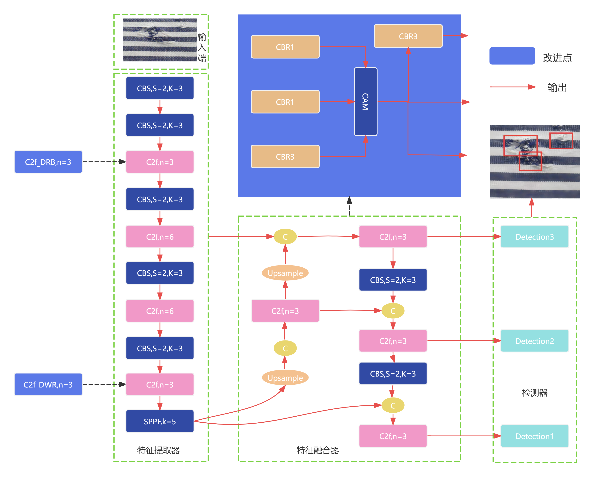
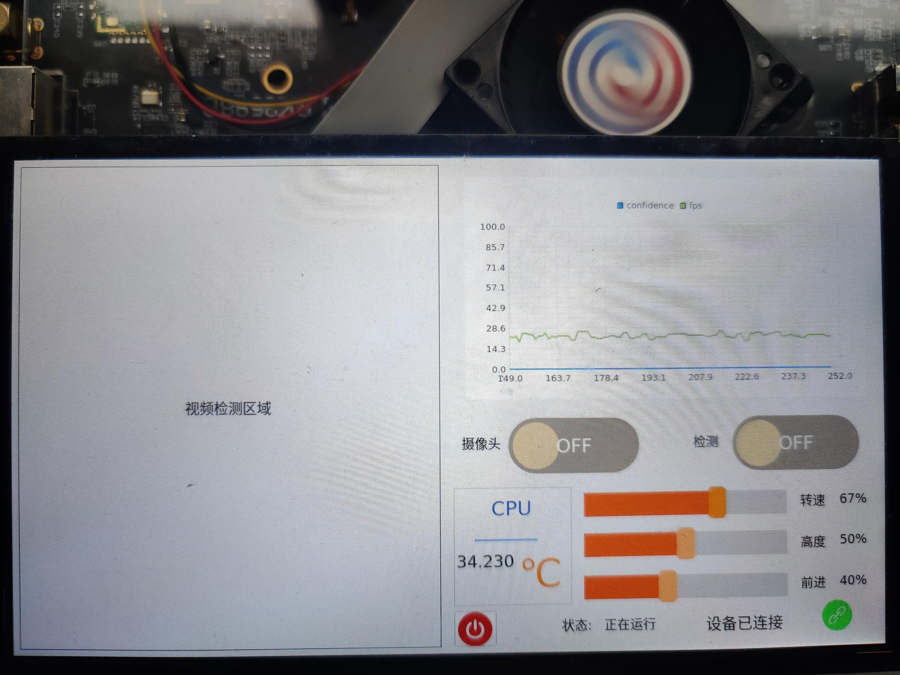
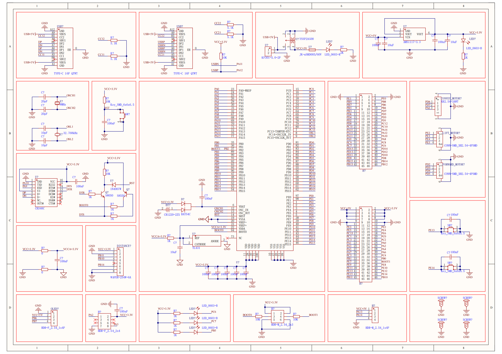
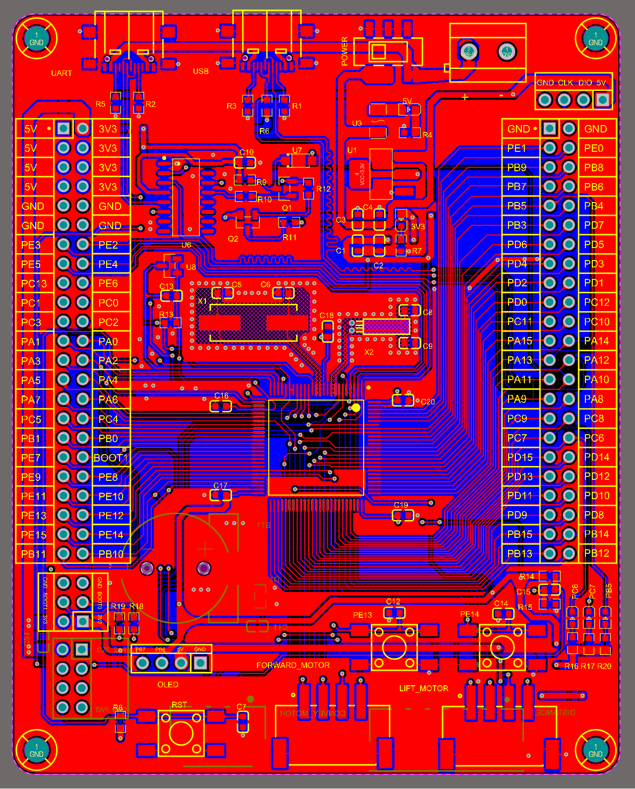
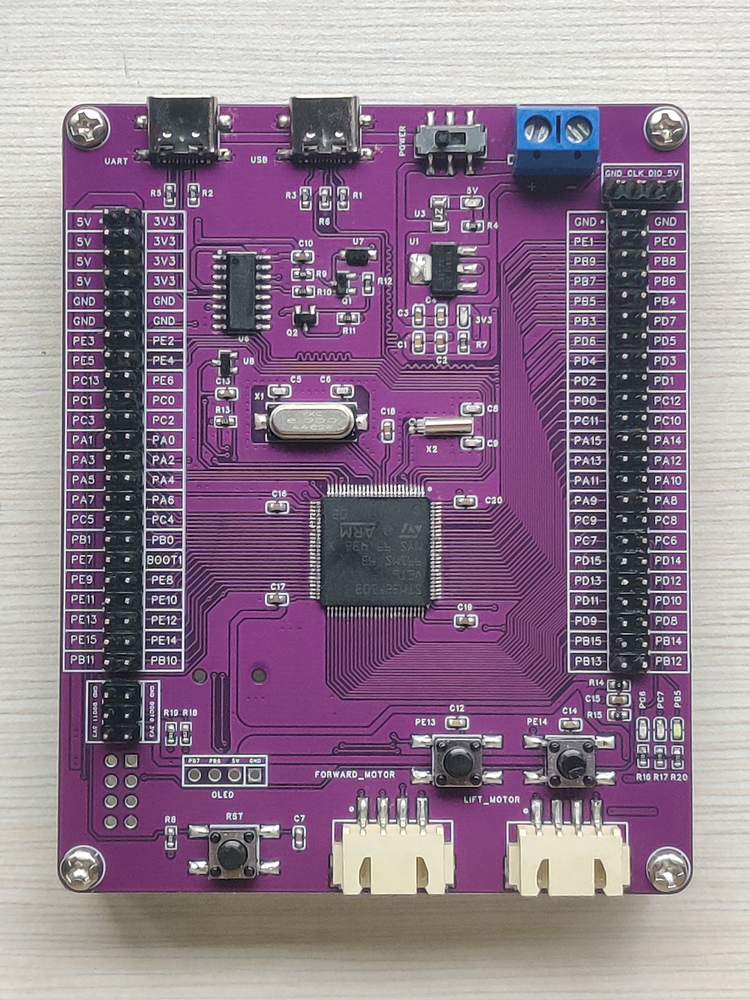
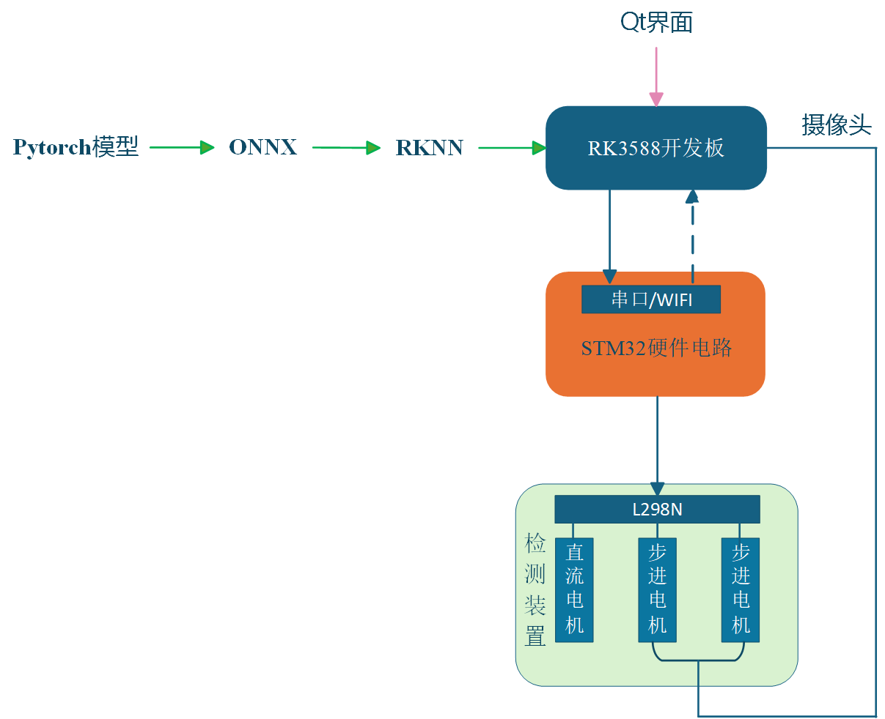
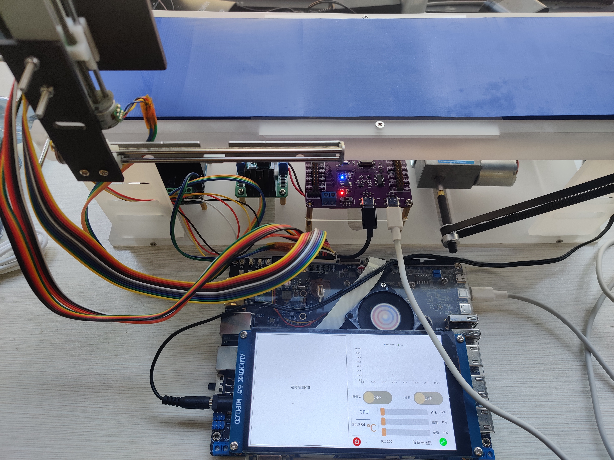

# 	**基于改进YOLOv8的织物瑕疵检测技术研究与应用**

注意：除机械部分、演示和stm32f103vet6这三个文件夹，其余代码均运行在Linux下，先在Linux下使用交叉编译器编译，生成可执行文件，再用adb工具推送到RK3588开发板上运行。机械部分文件夹存放的是Solidworks单个零件模型文件和最后的装配模型，stm32f103vet6文件夹里面是stm32单片机工程，是采用hal库编写，但是由于时间问题和本人能力有限，qt程序和stm32控制程序没有严格按照设计模式编写，因为如果要每个部分都要拆分成模块化并实现，需要大量的时间去分析软件架构与实现思路，在此抱歉。models文件夹里面存放了一个织物瑕疵的rknn格式模型，但是由于本人之前在Linux下进行了大量的模型转换与训练操作，已经不知道该模型包含哪些疵点了，这就是作为一个示例吧，同时也有一个conver.py脚本文件，这个脚本是RK官方提供将ONNX格式转为RKNN格式模型。

本研究围绕 “纺织工业织物瑕疵智能化检测” 核心需求，融合计算机视觉、嵌入式技术、硬件设计与机械工程，构建了 “算法优化 - 软件开发 - 硬件实现 - 机械适配 - 系统集成” 的完整技术链条，完成了从理论改进到实际应用的落地验证。

## 一、算法部分

1、跨层特征金字塔变换器（CFPT） 模块设计（轻量化上采样优化）：针对织物小瑕疵（如纱线断头等尺寸＜5mm  的缺陷）特征不明显、易被忽略的问题，设计  “融合全局上下文的轻量化上采样（CFPT）模块”，替代传统双线性插值上采样。通过全局平均池化提取上下文信息，结合 1×1  卷积压缩通道数，在增强小瑕疵特征表达的同时，降低模型计算量（相比原模型减少 18% FLOPs），使改进后模型平均精度（mAP）提升至  85.3%。DOI:[DU Z, HU Z, ZHAO G, et al. Cross-Layer Feature Pyramid Transformer for Small Object Detection in 2024,15(8): 476.]()

2、扩张式残差（DWR）模块扩张重参数块（DRB）：为适配织物瑕疵 “尺度差异大”（如破洞直径 1-20mm、染色不均区域＞5mm）的特点，引入 “扩张式残差（DWR）模块” 与  “扩张重参数块（DRB）”：DWR 模块通过不同扩张率的卷积核捕获多尺度特征，DRB  模块通过训练时多分支、推理时重参数化，在不增加计算量的前提下强化特征融合能力，进一步提升模型对多尺度瑕疵的识别适应性。DOI, DWR:[WEI H, LIU X, XU S, et al. DWRSeg: Rethinking Efficient Acquisition of Multi-scale Contextual Information for Real-time Semantic Segmentation[J]. 2022.]()  DRB:[DING X, ZHANG Y, GE Y, et al. UniRepLKNet: A Universal Perception Large-Kernel ConvNet for Audio, Video, Point Cloud, Time-Series and Image Recognition[J]. 2023.]()

3、**损失函数优化**：将原模型的 CIoU 损失函数替换为 WIoU v3 损失函数，通过 “动态权重分配” 聚焦难分样本（如与织物纹理相似的瑕疵），优化边界框回归精度，减少因瑕疵边界模糊导致的误检、漏检问题。DOI:[TONG Z, CHEN Y, XU Z, et al. Wise-IoU: Bounding Box Regression Loss with Dynamic Focusing Mechanism[J]. 2023.]()

​													算法改进原理图

## 二、软件部分

基于 Qt 5.15 框架与 C++ 语言构建可视化交互界面，实现 “检测监控 - 数据可视化 - 设备控制” 一体化功能，支撑系统端到端检测流程。

左侧集成视频渲染控件，实时显示织物瑕疵检测画面（使用qt定时器将画面一帧帧显示到QLabel控件上），直观呈现瑕疵框标注、类别及置信度。右上嵌入 QChart 图表组件，动态绘制并更新系统运行关键指标（实时 fps：0-30fps、检测平均精度：0-100%），辅助监控算法性能稳定性，同时重写 2 个自定义 QPushButton 控件，通过信号槽机制精准控制视频流启停与检测功能开关，避免操作冲突。该界面集成电机状态显示区，实时反馈 3 台步进电机（摄像头移动、传送带驱动）的运行负载百分比（0-100%），保障硬件与算法协同可控。

									运行在RK3588开发板上的Qt界面

## 三、硬件部分

以 Cortex-M3 内核的 STM32F103VET6 为核心，使用Altium Designer设计织物瑕疵检测系统的硬件控制板，承担电机驱动、外设扩展与系统协同功能，支撑硬件层与算法层（RK3588）的联动。

主控与供电 / 下载设计：集成 STM32 最小系统（含电源、复位、时钟电路），采用 Type-C 接口实现 “供电 + 程序下载” 二合一功能，简化硬件连接，提升调试便捷性。

电机控制接口设计：通过 2 个 XH2.54-4P 端子连接 L298N 驱动模块，精准控制 2 台步进电机（分别对应摄像头移动、传送带调速），另设 1 个 XH2.54-3P 端子连接 L298N 驱动直流电机，满足系统多电机协同控制需求。

调试与扩展接口设计：板载 2 个测试按键，支持电机单独启停调试（无需依赖上位机，缩短调试周期）；预留排针接口（含 ESP8266 无线通信、OLED 显示屏接口），具备功能扩展能力；新增 BAT 引脚供电接口，支持备用电源接入，提升工业场景下的供电稳定性；

采用 “主控芯片居中” 布局，优化高低频信号布线，减少电机驱动信号干扰，保障控制指令传输稳定性，整体硬件适配织物瑕疵检测系统的小型化需求，为后续 3D 打印机械装置集成奠定基础；

硬件板实现多电机精准控制、外设灵活扩展与便捷调试，支撑系统完成 “织物输送 - 摄像头定位 - 瑕疵检测” 全流程自动化，保障检测过程中设备协同的稳定性。

​													原理图

​													PCB图

​													实物图

## 四、嵌入式部署

针对织物瑕疵检测模型的嵌入式落地需求，设计 “PyTorch→ONNX→RKNN” 的模型转换链路，同时完成 Qt 可视化界面的交叉编译与开发板集成，实现 “模型推理 - 界面交互” 的端到端协同运行，支撑系统从实验室算法到嵌入式硬件的落地。

模型格式转换：基于 RK 官方工程（如 RKNN Model Zoo），先将训练完成的 PyTorch 模型导出为 ONNX  格式，过程中通过指定输入输出节点、禁用动态维度，解决算子不兼容问题，确保  ONNX 模型可正常解析。

RKNN 格式转换与量化优化：使用 RKNN Toolkit 2 工具将 ONNX 模型转为 RK3588 支持的 RKNN 格式，适配开发板存储资源与 NPU 算力需求。

转换验证：通过 RKNN Toolkit 的 “推理测试” 功能，在 PC 端预验证 RKNN 模型推理正确性，确保瑕疵类别识别、边界框回归结果与 PyTorch 原模型一致，避免开发板部署后出现功能异常。

交叉编译环境搭建：在 Ubuntu 20.04 系统中配置 ARM 架构交叉编译工具链（arm-linux-gnueabihf-gcc  9.4.0），结合 Qt Creator 配置交叉编译套件，指定 RK3588 开发板的 Ubuntu 20.04 系统作为目标平台，解决  “x86 架构编译文件无法在 ARM 架构运行” 的兼容性问题。

界面适配与依赖库移植：针对 RK3588 开发板的5.5英寸显示屏，调整 Qt  界面布局（如控件大小、图表尺寸），避免显示错位；手动移植 Qt 界面依赖的第三方库（如 QChart、SerialPort  库）到开发板，确保界面的 “实时视频渲染、数据图表绘制、通信（与 STM32 交互）” 功能正常；

编译测试：通过 “远程部署” 功能或者使用adb命令将编译后的 Qt 可执行文件推送至 RK3588，在开发板端启动界面并测试所有功能，确保 “视频启停、检测开关、电机状态显示、推理结果展示” 等操作正常，无卡顿或崩溃。

​															检测系统架构图

通过模型部署与界面适配，使织物瑕疵检测系统从 “PC 端验证” 落地到 “嵌入式硬件”，摆脱对高性能 PC 的依赖，同时实现检测流程可视化、操作便捷化，为后续与 3D 打印机械装置集成、模拟工业场景测试奠定基础，推动系统向实用化落地迈进。

# 五、机械检测装置

作为系统 “物理执行载体”，围绕 “织物自动化输送、摄像头精准定位、硬件集成适配” 核心需求，采用 SolidWorks 建模 + 3D  打印成型，设计小型化机械检测装置，解决 “算法推理需稳定织物图像输入、硬件设备需紧凑安装” 问题，支撑整个检测系统从 “软件算法” 到  “物理运行” 的落地。

<video src="./演示/传送装置.mp4" controls=""></video>

​														检测装置

机械装置与 “STM32 硬件控制 + RK3588 模型推理 + Qt 界面” 全链路联动测试：在摄像头拍摄图像清晰度满足算法需求（瑕疵细节分辨率≥0.1mm），最终实现 “织物自动输送→摄像头精准拍摄→算法实时检测” 全流程自动化。

​												检测系统实物图

<video src="./演示/202510241722.mp4" controls=""></video>

​												检测系统实时运行画面

